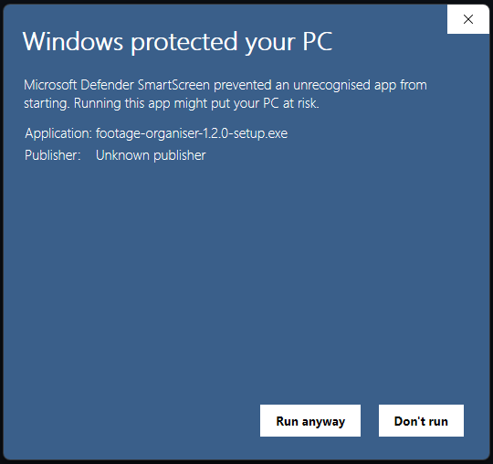
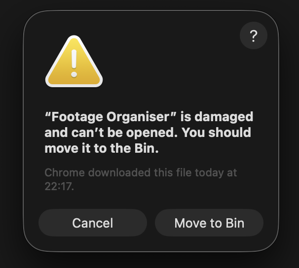

# Footage Organiser

After filming a bunch of vlogs, once a week or so I would do the annoying long process of transferring all the footage from different cameras into their well organised place in my hard drives. Then I would have to clean the cameras hard drives and then mirror everything to my backup hard drive. I was sick of doing all of this. This desktop application automates the entire process.

So this is the footage organiser. The goal is to automate all that annoying boring stuff after you've filmed and before you've started editing.

How it works? Well you install the app, and create some rules which tell the app where to copy from and to, and how to do it. Then the app can automatically follow these rules in the background, or require manual intervention to work. The **help** section in the app goes into a lot of detail

## Installing, Updating and Using

### Windows Installation

If installing on Windows. Download the .exe file from the [latest release](https://github.com/drewloynes/FootageOrganiser/releases).

Once downloaded, double click to begin the install.

**Be Aware:** I dont want to pay lots of money to big companies to get this app signed (authenticated to say its safe). Therefore you will encounter the following warning screen saying 'Windows protected your PC'.


Simply click 'More info'.



And click 'Run anyway'.

This will now install the Footage Organiser.

### Mac Installation

If installing on Mac. Download the .dmg file from the [latest release](https://github.com/drewloynes/FootageOrganiser/releases).

Follow the usual process of running the DMG file and copying Footage Organiser into the Applications folder.

**Be Aware:** Run the Footage Organiser and you will see the following alert as I do not want to pay a bunch of money to apple every year to get this side project signed.



In order to run the Footage Organiser, you must:

- Open the Terminal App.
- Enter the command `xattr -cr "/Applications/Footage Organiser.app”`.
  - You will likeily have to delete and re-add the quotes "" in the command as Macs will copy them incorrectly.

### Updating

To update the Footage Organiser. Simply remove the old Footage Organiser and then repeat the installation process.

### Using

I have add a large amount of detail in the help section of the app to assisting in learning how to use it.

## Contributing

This application is fully open source. Pull requests and contributions are welcome!

### Setup

#### Install

```bash
$ pnpm install
```

#### Development

```bash
$ pnpm dev
```

#### Production

```bash
$ pnpm start
```

#### Build

```bash
# For windows
$ pnpm build:win

# For macOS
$ pnpm build:mac
```

### Release

To publish a release:

- Commit a version bump:
  - Bump version in package.json
  - Bump version in changelog
- Create a release from this version bump:
  - Create and push a tag from main
  - A draft release will be created. Add more details and publish the release.

### Design

This is an electron application with 3 processes:

- Main process is the typical electron application entry point. It doesnt do very much other then start the application and pass messages between the renderer and worker processes.
- Renderer process is the typical electron application renderer process, this is written in react and uses a lot of ShadCN.
- Worker process is spawned by the main process. This is the scheduler which performs the event loop for the application. That is evaluation of rules, then execution of any actions for the rules.

### Logs

I've designed this with what looks to be pretty aggressive logging. This speeds up debugging as all the logs to immediately identify problems are already there.

Please follow the logging convention.

A logs folder will be created, writing all these logs to disk. Remember to delete this every so often, otherwise it can start to eat up storage.

You can modify what logs are filtered in etc using:

```typescript
const loggerConfig: LoggingConfiguration = {
  dev: true,
  logLevel: 'func',
  logProcess: [],
  logFunc: [],
  logFile: [],
  logArea: []
}
```

Inside loggerConfig.ts

```typescript
const CLIENT_LOG_CONFIG: ClientLoggingConfiguration = {
  dev: true,
  level: [],
  func: [],
  file: [],
  area: []
}
```

Inside clientLoggerConfig.ts

The dev value will automatically change to false when running not in dev, using scripts/setProd.mjs.

## Code Signing

There is none. I don't want to spend the money and go through the annoying process of getting this app signed. This does mean there will be warnings when first using the app.

Likewise, the app has not been setup for the Microsoft or Apple stores for similar reasons of avoiding bureaucracy.
